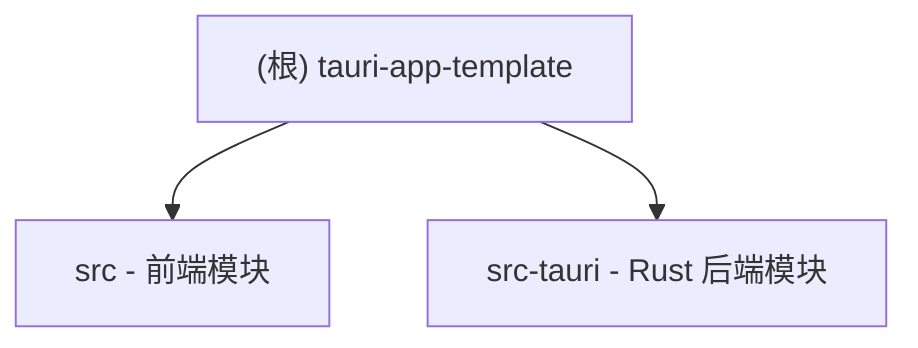

# Tauri App Template

## 项目愿景

基于 Tauri v2 + React 19 + TypeScript + shadcn/ui 的桌面应用开发模板，提供现代化的跨平台桌面应用开发基础架构。

## 架构总览

本项目采用前后端分离架构：

- **前端**: React 19 + TypeScript + Vite + Tailwind CSS v4 + shadcn/ui
- **后端**: Tauri v2 (Rust)
- **构建**: pnpm + Vite + Cargo



## 模块索引

| 模块 | 路径 | 语言/框架 | 职责 |
|------|------|-----------|------|
| 前端 | `src/` | TypeScript/React | 用户界面、组件、样式 |
| 后端 | `src-tauri/` | Rust | 系统调用、原生功能 |

## 运行与开发

### 环境要求

- Node.js >= 18
- pnpm >= 9
- Rust >= 1.70

### 安装依赖

```bash
pnpm install
```

### 开发模式

```bash
pnpm tauri dev     # 启动 Tauri 开发服务器
pnpm dev           # 仅启动 Vite 开发服务器
```

### 构建发布

```bash
pnpm tauri build   # 构建生产版本
pnpm build         # 仅构建前端
```

### 代码格式化

```bash
pnpm format        # 格式化代码
pnpm format:check  # 检查代码格式
```

## 测试策略

当前项目为模板项目，暂无测试配置。建议后续添加：

- **前端测试**: Vitest + React Testing Library
- **E2E 测试**: Playwright / Tauri WebDriver
- **Rust 测试**: Cargo test

## 编码规范

### TypeScript/React

- 使用 TypeScript 严格模式
- 使用函数组件和 Hooks
- 路径别名: `@/` 映射到 `src/`
- 使用 Prettier 格式化代码

### Rust

- 遵循 Rust 标准命名规范
- Tauri 命令使用 `#[tauri::command]` 宏

### CSS/样式

- 使用 Tailwind CSS v4
- 支持 shadcn/ui 组件系统
- CSS 变量主题系统（亮色/暗色模式）

## AI 使用指引

### 项目特定约定

1. **组件开发**: 使用 `pnpm dlx shadcn@latest add <component>` 添加 shadcn/ui 组件
2. **路径别名**: 使用 `@/` 前缀导入模块，如 `import { Button } from "@/components/ui/button"`
3. **Tauri 命令**: 在 `src-tauri/src/lib.rs` 中定义，使用 `invoke()` 从前端调用

### 常用操作

```typescript
// 调用 Rust 后端命令
import { invoke } from "@tauri-apps/api/core";
const result = await invoke("command_name", { arg1: value });
```

```rust
// 定义 Tauri 命令 (src-tauri/src/lib.rs)
#[tauri::command]
fn command_name(arg1: &str) -> String {
    format!("Result: {}", arg1)
}
```

## 变更记录 (Changelog)

| 日期 | 变更内容 |
|------|----------|
| 2026-03-16 | 初始化 AI 上下文文档 |

---

## 前端模块 (src)

### 模块职责

负责用户界面的渲染、交互和样式管理。

### 入口与启动

- **入口文件**: `src/main.tsx`
- **主组件**: `src/App.tsx`
- **构建工具**: Vite (配置: `vite.config.ts`)

### 对外接口

| 文件 | 说明 |
|------|------|
| `src/App.tsx` | 主应用组件，包含 greet 示例 |

### 关键依赖与配置

**主要依赖**:
- react@19.1.0 - UI 框架
- react-dom@19.1.0 - React DOM 渲染
- @tauri-apps/api@2 - Tauri 前端 API
- @tauri-apps/plugin-opener@2 - 外部链接打开插件
- tailwindcss@4.2.1 - CSS 框架
- class-variance-authority@0.7.1 - CSS 变体管理
- clsx@2.1.1 - 类名合并
- lucide-react@0.577.0 - 图标库
- radix-ui@1.4.3 - 无样式 UI 原语

**开发依赖**:
- typescript@5.8.3
- vite@7.0.4
- @vitejs/plugin-react@4.6.0
- prettier@3.8.1

**配置文件**:
- `tsconfig.json` - TypeScript 配置（严格模式）
- `vite.config.ts` - Vite 构建配置
- `components.json` - shadcn/ui 配置

### 数据模型

当前为模板项目，无持久化数据模型。

### 测试与质量

- **格式化工具**: Prettier
- **配置**: `.prettierrc`
- **忽略**: `.prettierignore`

### 相关文件清单

```
src/
├── main.tsx          # 入口文件
├── App.tsx           # 主应用组件
├── App.css           # 应用样式
├── index.css         # 全局样式 + Tailwind 主题
├── vite-env.d.ts     # Vite 类型声明
├── assets/
│   └── react.svg     # React logo 资源
├── components/
│   └── ui/
│       └── button.tsx # shadcn/ui Button 组件
└── lib/
    └── utils.ts      # 工具函数 (cn 类名合并)
```

---

## 后端模块 (src-tauri)

### 模块职责

负责系统级调用、原生功能集成和跨平台桌面应用封装。

### 入口与启动

- **入口文件**: `src-tauri/src/main.rs`
- **应用逻辑**: `src-tauri/src/lib.rs`
- **构建配置**: `Cargo.toml`

### 对外接口

| 命令 | 参数 | 返回值 | 说明 |
|------|------|--------|------|
| `greet` | `name: &str` | `String` | 示例命令，返回问候语 |

### 关键依赖与配置

**Cargo 依赖**:
- tauri@2 - Tauri 框架
- tauri-plugin-opener@2 - 外部链接打开插件
- serde@1 - 序列化框架
- serde_json@1 - JSON 支持

**配置文件**:
- `tauri.conf.json` - Tauri 应用配置
- `capabilities/default.json` - 权限配置

**Tauri 配置要点**:
- 产品名: `tauri-app-template`
- 标识符: `com.template.tauri-app`
- 窗口尺寸: 800x600
- 开发端口: 1420

### 数据模型

无持久化数据模型。

### 测试与质量

- 使用 `cargo test` 运行 Rust 测试
- 当前无测试用例

### 相关文件清单

```
src-tauri/
├── Cargo.toml           # Rust 依赖配置
├── tauri.conf.json      # Tauri 应用配置
├── build.rs             # Rust 构建脚本
├── src/
│   ├── main.rs          # Rust 入口
│   └── lib.rs           # Tauri 应用逻辑
├── capabilities/
│   └── default.json     # 权限配置
└── icons/               # 应用图标
    ├── icon.png
    ├── icon.ico
    ├── icon.icns
    └── ... (各尺寸图标)
```